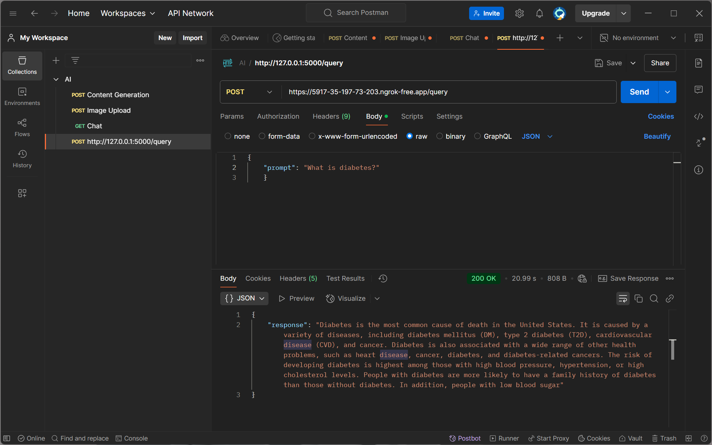

# Fine-Tuned GPT-2 for Domain-Specific Tasks

## 📌 Project Overview

This project demonstrates the fine-tuning of GPT-2 using **LoRA (Low-Rank Adaptation)** on a **custom dataset** within a single Jupyter notebook (`.ipynb`). It includes data preparation, fine-tuning processes, and deployment via a Flask API, made publicly accessible through ngrok for interactive querying.

---

## 🚀 Key Accomplishments

- ✅ **Fine-tuned GPT-2** using LoRA on a domain-specific dataset.
- ✅ **Deployed an interactive Flask API** accessible via ngrok.
- ✅ **Optimized inference parameters** for concise and coherent responses.

---

## 🛠️ Technologies Used

- **GPT-2** (via Hugging Face Transformers)
- **LoRA (PEFT)** for efficient fine-tuning
- **Flask** for API deployment
- **ngrok** for public URL access
- **Google Colab**

---

---

## 📸 Screenshot

